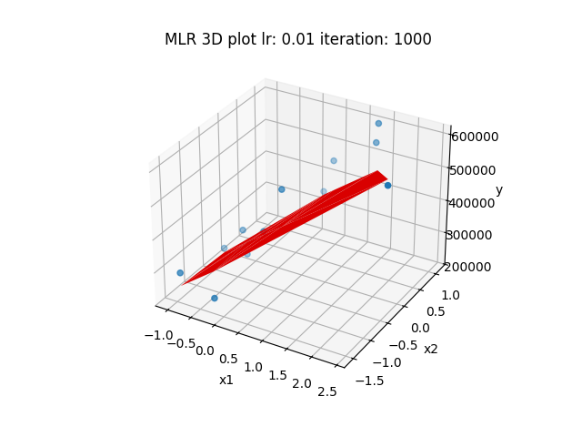

# Multiple Linear Regression



The project implement ***Multiple Linear Regression*** from scratch<br/>
And the project is using Python Language<br/>

## Features
- Calculating MSE and RMSE (hyperparameter) in each iteration and saving it to log file<br/>
- Calculating parameter and saving it to json file<br/>
- Fuction to draw MSE and RMSE figure (only 2 features)<br/>
- Predicting value<br/>

## Requirement package
> matplotlib<br/>
> numpy<br/>
> openpyxl<br/>
> pandas<br/>
> seaborn<br/>

## Usage
All Implementation is in *Linear_Regression/MLR.py* and run below commend to launch MLR class<br/>
```shell
python ./main.py -i 1000 --learn_rate 0.01
```

## Dataset
Vehicle CO<sub>2</sub> Dataset<br/>https://www.kaggle.com/datasets/brsahan/vehicle-co2-emissions-dataset
https://open.canada.ca/data/en/dataset/98f1a129-f628-4ce4-b24d-6f16bf24dd64#wb-auto-6

## Running Time
Running on Python 3.12.1 and MSVC (C++ 14) Release with Windows 11 system(Memory 16GB)<br/>
Running each program 5 times<br/>
Python version: 0.4571527481079102 seconds<br/>
C++ version: 0.00019118 seconds<br/>

## Contributor
- Z-score https://en.wikipedia.org/wiki/Standard_score<br/>
- RMSE http://en.wikipedia.org/wiki/Root_mean_square_deviation<br/>